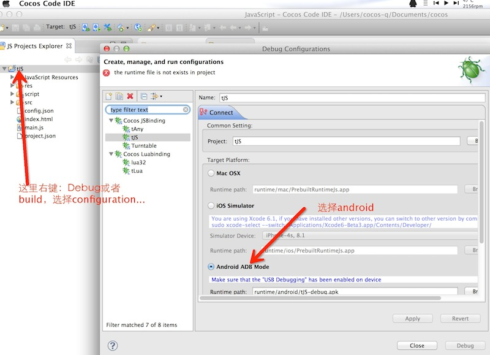
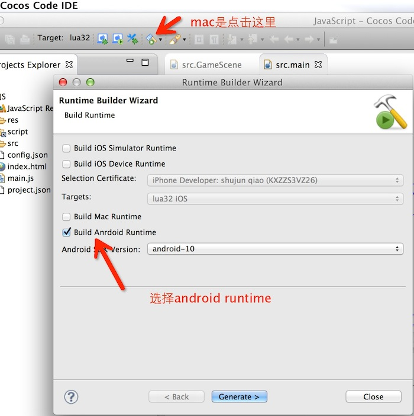

Sample_Lua
==========
简要说明：sample of anysdk_lua

使用版本：cocos2d-x 3.3rc0

接入文档：http://docs.anysdk.com/LuaTutorial

运行：/frameworks/cocos2d-x/tools/cocos2d-console/abin/cocos run -p android

更新说明：
<pre>1：在 frameworks/cocos2d-x/external 增加第三方扩展库 
2：在 frameworks/cocos2d-x/tools/cocos下增加 abin
3：修改main.lua下 isSupportFunction--> isFunctionSupported
</pre>
备注：
使用code-ide时，找不到 AgentManager: attemp to index global 'AgentManager' (a nil value)
<pre>
1：请运行到android真机；
2：请重新编译项目。
</pre>
运行到手机：

重新编译：

